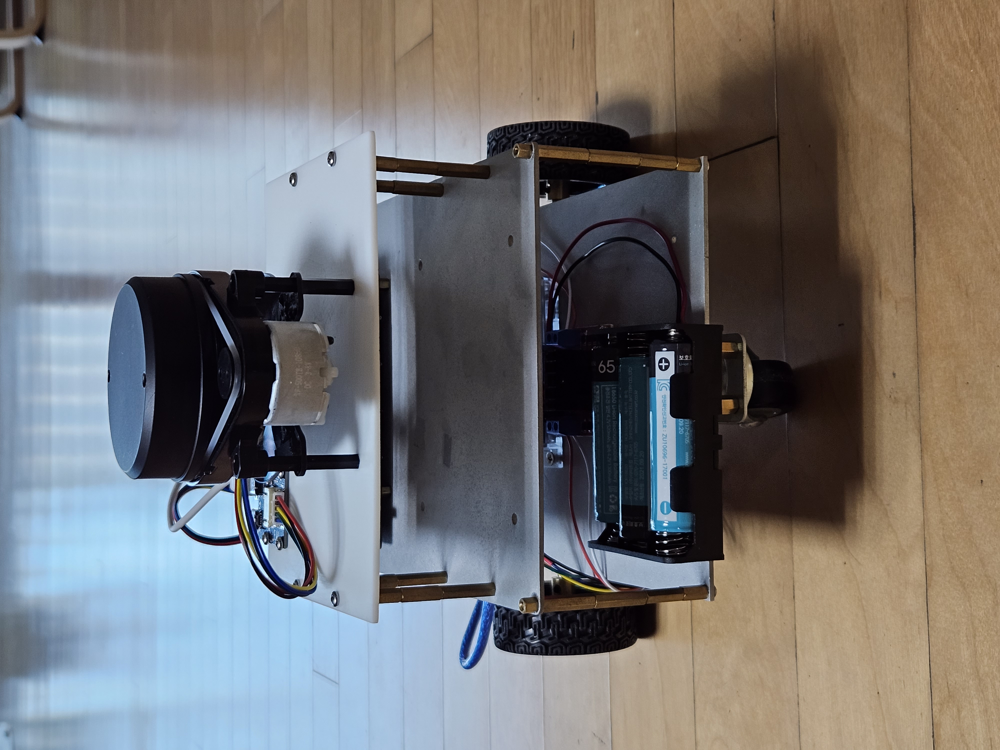
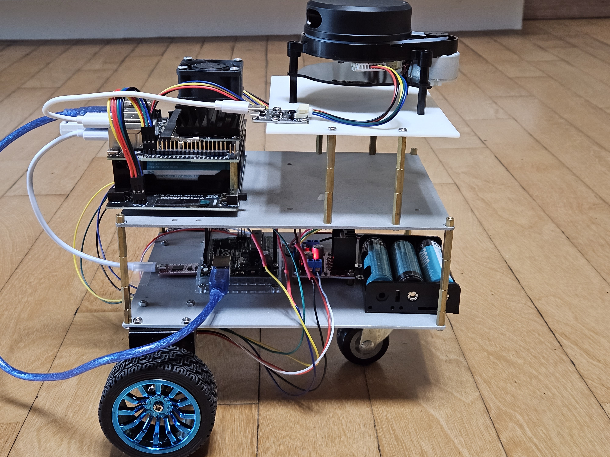
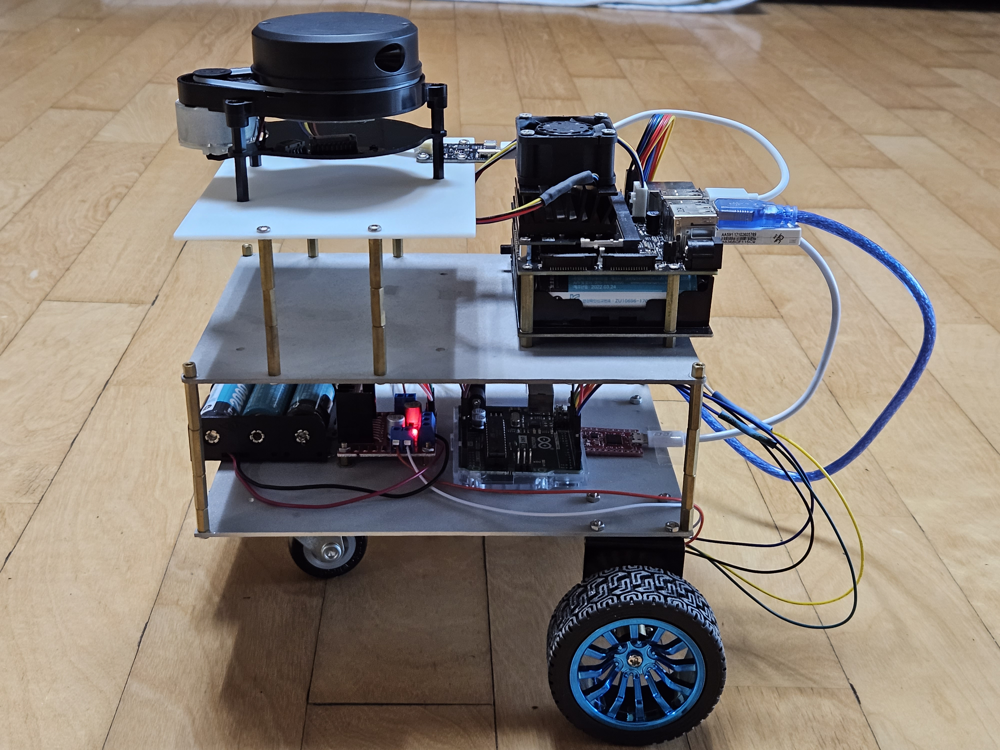

<H1>KWJ ROBOT</H1>
나의 첫번째 ROS를 이용한 DIY로봇  

  
<h2>기능</h2> 
SLAM  

>Gmapping, Hector_slam

Teleop_Twist_Keyboard

Navigation

Path Planning

>Global path planning, Local path planning

<h2>하드웨어</h2>

SBC

>Jetson Nano Developer Kit 4GB, +cooling pan

Micro Controller Unit

>Arduino UNO

Motor

>JGB37-520 encoder motor x2

Motor Driver

>L298N

Battery

>18650 battery x7, battery holder, Jetson nano UPS Power Module

Lidar

>YDLidar X4 -> change YDLidar X4 Pro

Imu

>myAHRS+ Imu

Standoff

>M3,M4

Networkcard

>ipTIME-N100 (Linux 지원)

캐스터 휠

로봇 CAD 파일

>1층: 

>2층: 

>3층: 

<h2>하드웨어 연결</h2>

<h3>1층</h3>


<h3>2층,3층</h3>


<h2>소프트웨어</h2>

Ubuntu

CAD: Blender

ROS

>Distribution: Melodic

>ROS Packages: rosserial, rosserial_python, rosserial_arduino, gmapping, hector_slam, navigation, myahrs_driver, teleop_twist_keyboard, ydlidar_ros_driver, YDLidar-SDK, urdf, joint_state_publisher, robot_state_publisher, amcl, costmap_2d, robot_pose_ekf

<h2>How To Launch</h2>

roscore, rosrun, roslaunch같은 ROS명령어를 사용하기 위해서는 항상 터미널마다 다음 단계를 따라야 합니다.

```$ source /opt/ros/melodic/setup.bash ```

```$ cd catkin_ws```

```$ source ./devel/setup.bash ```

>만약 catkin_ws 워크스페이스 안에 코드를 추가하거나 변경했을 때 워크스페이스 안의 모든 코드를 컴파일 하는 과정이 필요합니다. 그 때에는 $ cd catkin_ws 다음 명령어를 추가해야 합니다.

```$ catkin_make```

<h3>Arduino</h3>

>PID_publish_ticks_teleop.ino -> 아두이노 디렉토리의 arduino.ino는 SLAM, Teleop_twist_keyboard를 할 때 Upload합니다.

>navigation.ino -> 아두이노 디렉토리의 navigation.ino는 Navigation을 수행할 때 Upload합니다.

<h3>Gmapping</h3>

```$ roscore```

```$ roslaunch kwj_slam gmapping.launch```

```$ rosrun teleop_twist_keyboard teleop_twist_keyboard.py```

```$ rviz```

>만약 맵을 다 그렸다면 맵을 저장하기 위해서는 터미널을 키고 다음 단계를 따라야 합니다. 

```$ rosrun map_server map_saver```

<h3>Hector_slam</h3>

```$ roscore```

```$ roslaunch kwj_slam hector_slam.launch```

```$ rosrun teleop_twist_keyboard teleop_twist_keyboard.py```

```$ rviz```

>만약 맵을 다 그렸다면 맵을 저장하기 위해서는 터미널을 키고 다음 단계를 따라야 합니다.

```$ rosrun map_server map_saver```

<h3>Navigation</h3>

```$ roscore```

```$ roslaunch kwj_navigation move_base.launch```

<h3>rqt_graph</h3>

rqt_graph는 현재 실행되는 노드,토픽들을 그래프로 보여줍니다.

```$ rosrun rqt_graph rqt_graph```

<h4> SLAM rqt_graph 실행 결과</h4>


<h4>Navigation rqt_graph 실행 결과</h4>


<h3> TF </h3>

현재 로봇의 TF를 그려줍니다.

```$ rosrun tf view_frames```

이 프로젝트에서 SLAM,Navigation 수행 전 rviz에서 2d estimate pose를 이용하여 tf를 연결시켜야 합니다.

<h4>SLAM TF</h4>


<h4>Navigation TF 연결 전</h4>


<h2>참고</h2>

DIY 로봇을 만들며 참고한 사이트와 책

>https://github.com/lbrombach/practical_robot

>https://github.com/zeta0707/jessicar2

>https://github.com/ROBOTIS-GIT/turtlebot3

>https://automaticaddison.com/how-to-set-up-the-ros-navigation-stack-on-a-robot/

>book: Practical Robotics in C++:: Build and Program Real Autonomous Robots Using Raspberry Pi,Brombach, Lloyd,ISBN13:9789389423464, ISBN10:9389423465

<h2>Repository 변화</h2>

>https://github.com/mulempyo/my_first_ros_robot -> https://github.com/mulempyo/64robot -> https://github.com/mulempyo/ros_robot


